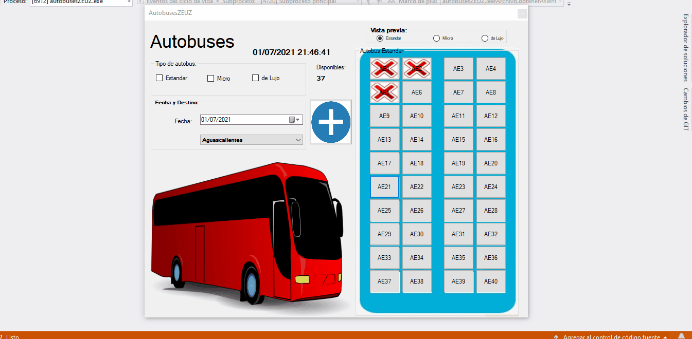
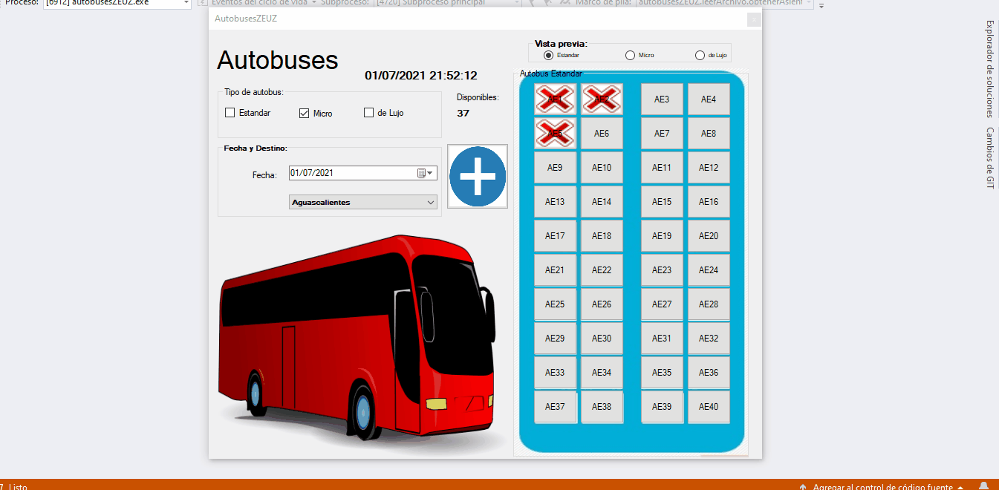

# Software de boletos de autobus.
Programa que simula la venta de asientos de autobuses y reservacion.

Realizado en c# y con lectura de archivos de texto (no DB).

Mediante la vista previa se visualiza la disponibilidad de los asientos de autobus dependiendo del destino, la fecha y el tipo de autobus a seleccionar. Ademas de mediante hacer clic mostrar el estatus del asiento (Si ya ha sido reservado por alguien o si se encuentra vacio).
 

Para comprar un boleto de autobus este debe de seleccionar el tipo de autobus (Estandar, Micro o de Lujo)(Checkbox), elegir la fecha de salida (DateTime) y el destino (ComboBox). Seguido de ello pulsar el boton de "+". Selecciona los asientos a alquilar, confirmar la seleccion e ingresar un nombre (del usuario comprador). 
 

En el menu de inicio se puede comprobar el estado de los autobuses y sus asientos (si ya han sido reservados o se encuentran libres).
 

